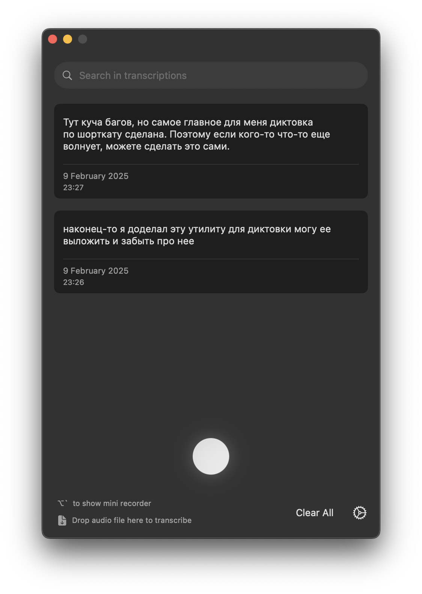

# OpenSuperWhisper

OpenSuperWhisper is a macOS application that provides real-time audio transcription using the Whisper model. It offers a seamless way to record and transcribe audio with customizable settings and keyboard shortcuts.

<p align="center">
 
</p>

Free alternative to paid services like:
* https://tryvoiceink.com
* https://goodsnooze.gumroad.com/l/macwhisper
* and etc..

## Features

- 🎙️ Real-time audio recording and transcription
- ⌨️ Global keyboard shortcuts for quick recording (use ```cmd + ` ```)
- 🌍 Support for multiple languages with auto-detection (not tested, but probably works)
- 🔄 Optional translation to English (not tested)
- 💾 Local storage of recordings with transcriptions
- 🎛️ Advanced transcription settings (not tested)

## Requirements

- macOS (Apple Silicon/ARM64)

## Installation

From github releases page download the latest version.

## Support

If you encounter any issues or have questions, please:
1. Check the existing issues in the repository
2. Create a new issue with detailed information about your problem
3. Include system information and logs when reporting bugs

## Contributing

Contributions are welcome! Please feel free to submit pull requests or create issues for bugs and feature requests.
